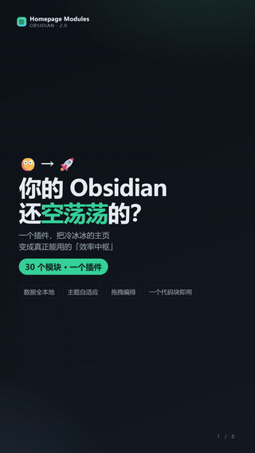
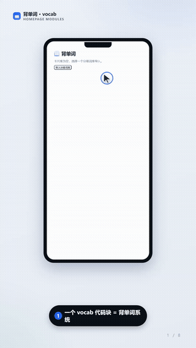
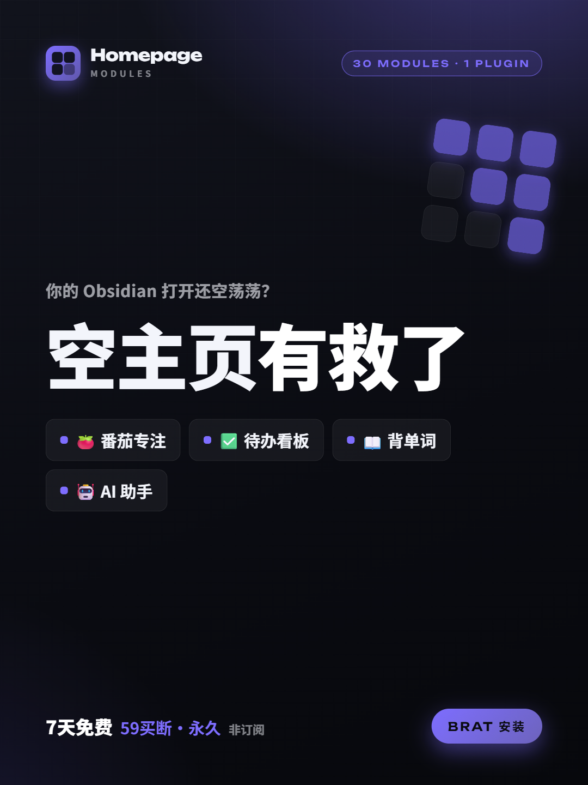
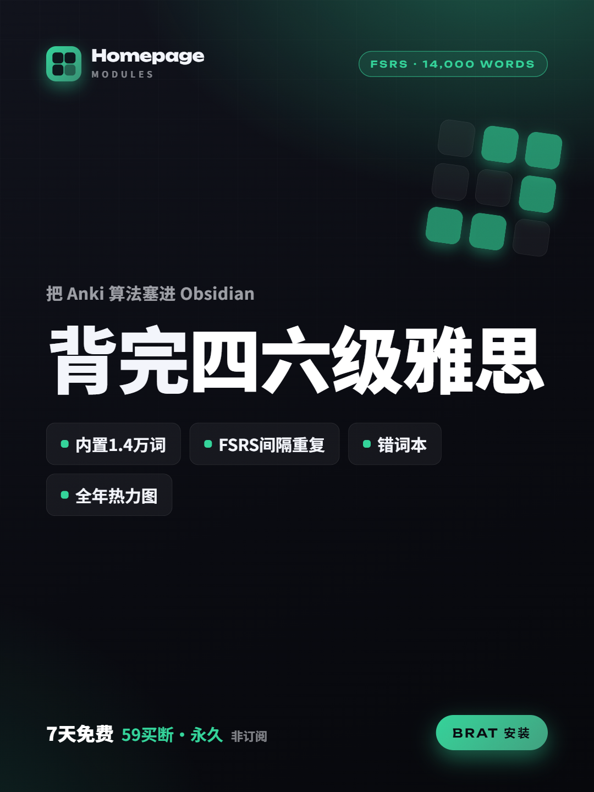
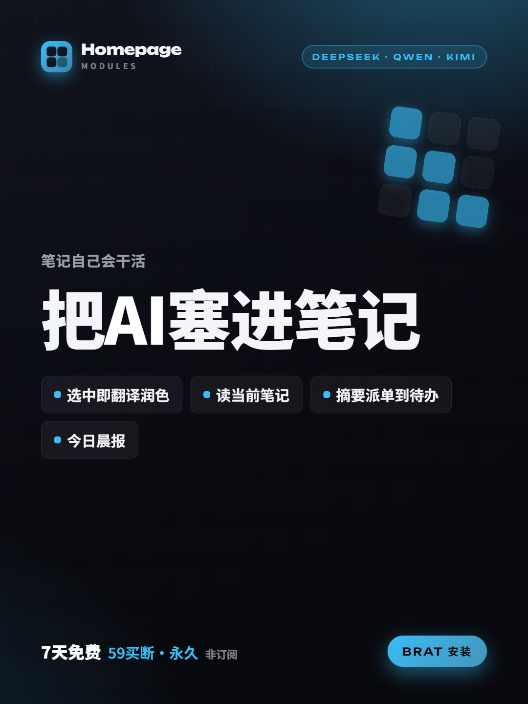
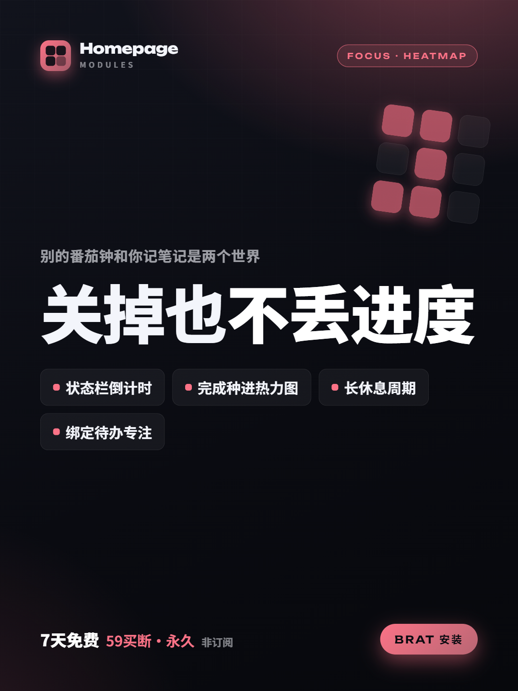
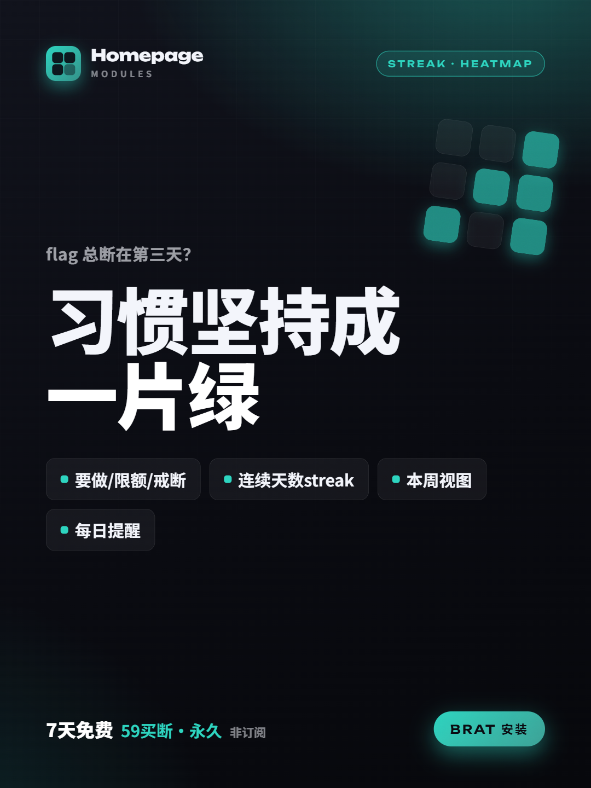
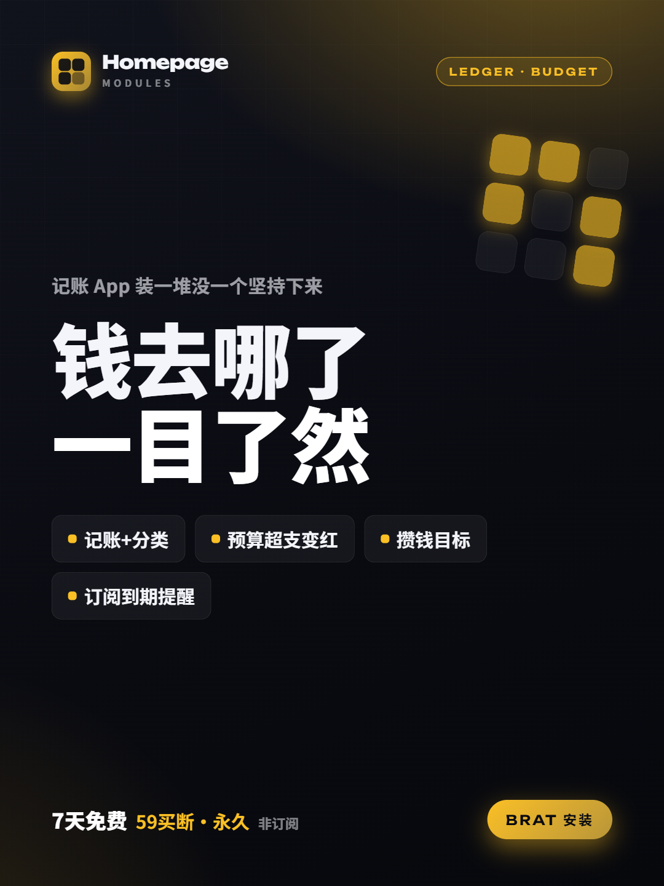

<p align="right"><a href="README.en.md">English</a> | 简体中文</p>

<h1 align="center">Homepage Modules</h1>

<p align="center">
一个插件塞进 <b>30 个模块</b>：待办看板 · 番茄专注 · 习惯打卡 · FSRS 背单词 · AI 助手 · 记账 · 日历 · 天气……<br/>
每个模块 <b>一个代码块即用</b>，数据 <b>全本地</b>，主页 <b>拖拽编排</b>、主题自适应、Ctrl+滚轮缩放。桌面 + 移动双端。
</p>

<p align="center">
  
  &nbsp;&nbsp;
  
</p>

## ⚡ 安装（BRAT，30 秒）

还没上架社区市场，用 **BRAT** 即可安装，自动跟随更新：

1. 社区插件市场搜索安装 **BRAT**（Obsidian42 - BRAT）并启用。
2. 命令面板运行 **BRAT: Add a beta plugin**，或在 BRAT 设置里点 **Add Beta Plugin**。
3. 仓库地址填：
   ```
   lv-g-eng/obsidian-homepage-modules
   ```
4. 在「第三方插件」里启用 **Homepage Modules**。
5. 新建一篇笔记，写个代码块就能用：

   ````markdown
   ```pomodoro
   title: 番茄专注
   focus: 25
   break: 5
   ```
   ````

   或运行命令 **生成工具箱主页** 一键铺满全部模块。

> 💡 背单词的完整词库（四级/六级/雅思 ≈1.4 万词）不打进插件本体，**首次使用会自动从 Release 下载并缓存**，BRAT 用户无需手动放文件。

价格：装上 **免费试用 7 天** 全解锁；**59 元一次买断、永久使用**（非订阅）。免费模块 `clock` `links` `countdown` `random` 永久可用。

> 这是对小红书付费插件「Obsidian 模块化主页」的自研实现，含可售卖的授权体系。

## 模块清单（30）

| 分类 | 模块（代码块标签） |
|------|------|
| 效率 (8) | `todo` 待办看板 · `today` 今日清单 · `overview` 今日概览 · `pomodoro` 番茄专注 · `pomodoro-heatmap` 专注热力图 · `timeblock` 时间块 · `countdown` 倒计时 · `capture` 快速捕获 |
| 习惯健康 (4) | `habit` 习惯打卡 · `mood` 心情记录 · `water` 喝水打卡 · `sleep` 睡眠记录 |
| 学习记忆 (4) | `vocab` 背单词(FSRS) · `flashcards` 记忆卡片 · `reading` 读书清单 · `review-queue` 复习队列 |
| AI (3) | `ai-chat` AI 助手 · `ai-summary` AI 摘要→派单 · `ai-brief` 今日晨报 |
| 财务 (4) | `ledger` 记账 · `budget` 预算 · `goal` 目标进度 · `subs` 订阅管理 |
| 仪表盘 (5) | `calendar` 日历 · `weather` 天气 · `stats` 库统计 · `links` 快捷链接 · `clock` 时钟 |
| 工具 (2) | `random` 随机决定 · `quote` 每日一言 |

免费模块：`clock` `links` `countdown` `random`；其余为专业版（7 天试用解锁）。

## 功能速览

<table>
  <tr>
    <td align="center"><br/><sub>30 模块 · 一个插件</sub></td>
    <td align="center"><br/><sub>FSRS 背单词 · 1.4 万词</sub></td>
    <td align="center"><br/><sub>AI 助手 · DeepSeek/Qwen</sub></td>
  </tr>
  <tr>
    <td align="center"><br/><sub>番茄专注 · 全年热力图</sub></td>
    <td align="center"><br/><sub>习惯打卡 · 连续天数</sub></td>
    <td align="center"><br/><sub>记账 · 预算 · 订阅</sub></td>
  </tr>
</table>

---

> 以下为开发 / 自部署内容，普通用户看上面「安装」即可。

## 开发 / 本地加载

```bash
npm install
npm run dev          # esbuild watch，产出 main.js
```

把 `main.js` `manifest.json` `styles.css` 放进测试库的 `<库>/.obsidian/plugins/homepage-modules/`：

- 方式一：设环境变量让 esbuild 直接输出到测试库
  ```powershell
  $env:HM_OUT="C:/TestVault/.obsidian/plugins/homepage-modules"; npm run dev
  ```
- 方式二：在该目录建符号链接指向本仓库产物
  ```powershell
  New-Item -ItemType SymbolicLink -Path "C:/TestVault/.obsidian/plugins/homepage-modules" -Target "D:/xiaohongshu/obsidian"
  ```

然后在 Obsidian「第三方插件」里启用。改代码会自动重建；装社区 **Hot-Reload** 插件可热重载。

## 验证

```bash
npx tsc -noEmit -skipLibCheck   # 类型检查
npm run build                    # 生产构建
node smoke-test.cjs              # 冒烟：桩 obsidian 加载产物，确认 31 个处理器注册
```

移动端测试：桌面 devtools 控制台执行 `this.app.emulateMobile(true)`；真机 Android 用 `chrome://inspect`，iOS 16.4+ 用 macOS Safari Web Inspector。

## 用法

新建一篇笔记，写：

````markdown
```pomodoro
title: 番茄专注
focus: 25
break: 5
```
````

或用命令面板「生成工具箱主页」一键生成包含全部模块的主页。详见 `示例主页.md`。

## 售卖 / 授权

授权后端在 `server/`（Cloudflare Worker + Ed25519 离线签名令牌 + 3 设备绑定），部署见 `server/README.md`。部署后把 `ACTIVATION_URL` 与 `SERVER_PUBLIC_KEY` 填进 `src/license/license-manager.ts` 再 `npm run build`。

> 注意：客户端插件本质可被改，授权层目标是「增加门槛」而非绝对防破解。

## 架构

- `src/core/` 模块系统、混合存储（data.json + `.homemodules/` JSON，跨设备 LWW 合并）、事件总线、设置、缩放
- `src/modules/<name>/` 各模块（一个代码块标签 + 渲染 + 数据）
- `src/ui/` 主页网格（拖拽）、组件（卡片、SVG 热力图、Modal）
- `src/ai/` OpenAI 兼容双传输客户端（桌面流式 / 移动 requestUrl）
- `src/license/` 试用 + 签名令牌离线校验 + 设备指纹
